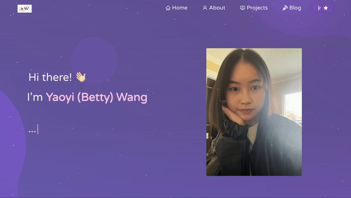

<h2 align="center">
  <a href="https://yaoyi.vercel.app/" target="_blank">Yaoyi's Portfolio</a>
</h2>
  

 &nbsp;
 &nbsp;
 &nbsp;
 &nbsp;

## Tech Stack

## Features

**📖 Multi-Page Layout**

**🎨 Styled with React-Bootstrap**

**📱 Fully Responsive**

## Getting Started

Clone the repository. You will need `node.js` and `git` installed globally on your machine.

## Installation and Setup

1. Installation: `npm install`

2. In the project directory, you can run: `npm start`

Run the app in the development mode.\
Open [http://localhost:3000](http://localhost:3000) with your browser to see the website.
The page will reload if you make edits.

